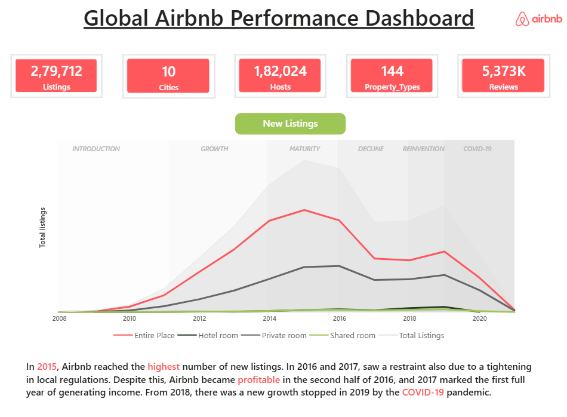
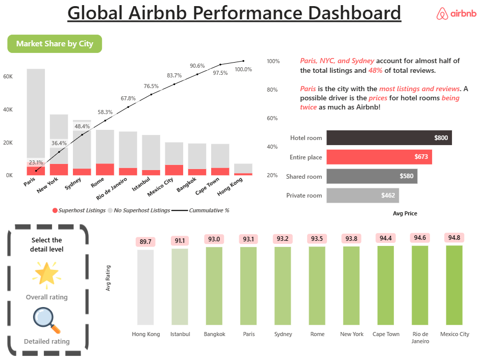
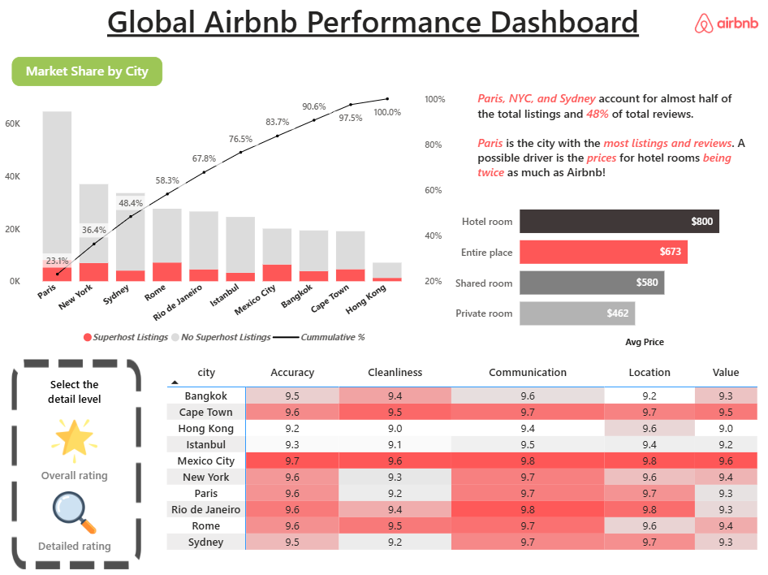
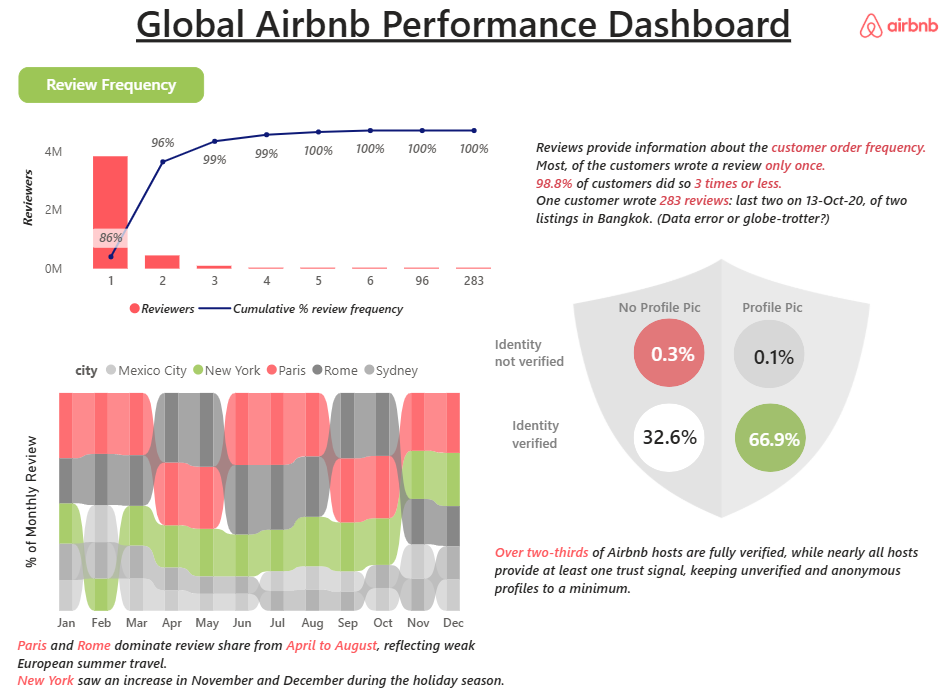

# 🌍 Global Airbnb Performance Dashboard

## 📌 Project Overview

This project is an interactive **Power BI dashboard** that analyzes Airbnb listings, hosts, ratings, pricing, and customer reviews across multiple global cities. The dashboard provides business insights into listing growth, market share, customer ratings, and review trends using interactive visualizations.

---

## 🎯 Objectives

- Analyze Airbnb listing performance across cities.
- Compare market share of listings.
- Understand customer ratings and review behavior.
- Visualize pricing by property type.
- Identify trends and patterns using interactive dashboards.

---

## 🛠️ Tools & Technologies

- Microsoft Power BI
- Power Query
- DAX (Data Analysis Expressions)
- Microsoft Excel

---

## 📊 Dashboard Pages

### 1. Overview
- KPI Cards
- Total Listings
- Total Hosts
- Total Reviews
- Property Types
- Listing Growth Trend

### 2. Ratings Analysis
- Market Share by City
- Average Price Comparison
- Rating Heatmap
- City-wise Rating Analysis
- Pareto Chart

### 3. Reviews Analysis
- Review Frequency Distribution
- Monthly Review Trends
- Identity Verification Analysis
- Customer Review Insights

---

## 📈 Key Insights

- Paris, New York, and Sydney contribute a significant share of Airbnb listings.
- Entire homes have the highest average prices.
- Most customers leave only one review.
- Verified hosts receive higher customer trust.
- Airbnb listings experienced rapid growth before the COVID-19 pandemic.

---

## 📂 Repository Contents

- Dashboard screenshots
- Data dictionaries
- Project documentation

> **Note:** The original Power BI (.pbix) file and full datasets exceed GitHub's file size limit (100 MB), so they are not included in this repository.

---

## 🖼 Dashboard Preview

### Overview

### Ratings Analysis

### Reviews Analysis

---

## 👩‍💻 Author

**Vandana Moray**

Computer Science Engineering Student | Aspiring Data Analyst

---

## ⭐ If you found this project useful, feel free to star this repository!
